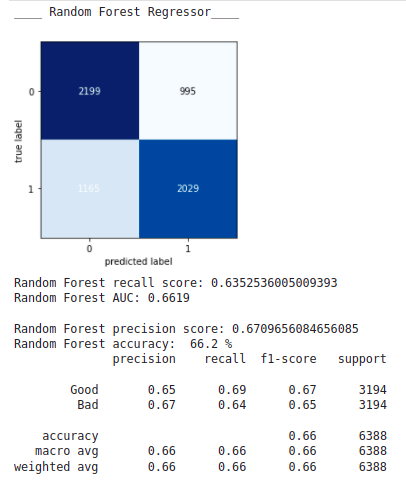
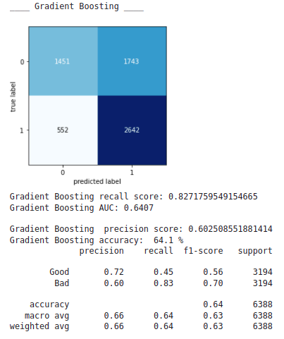
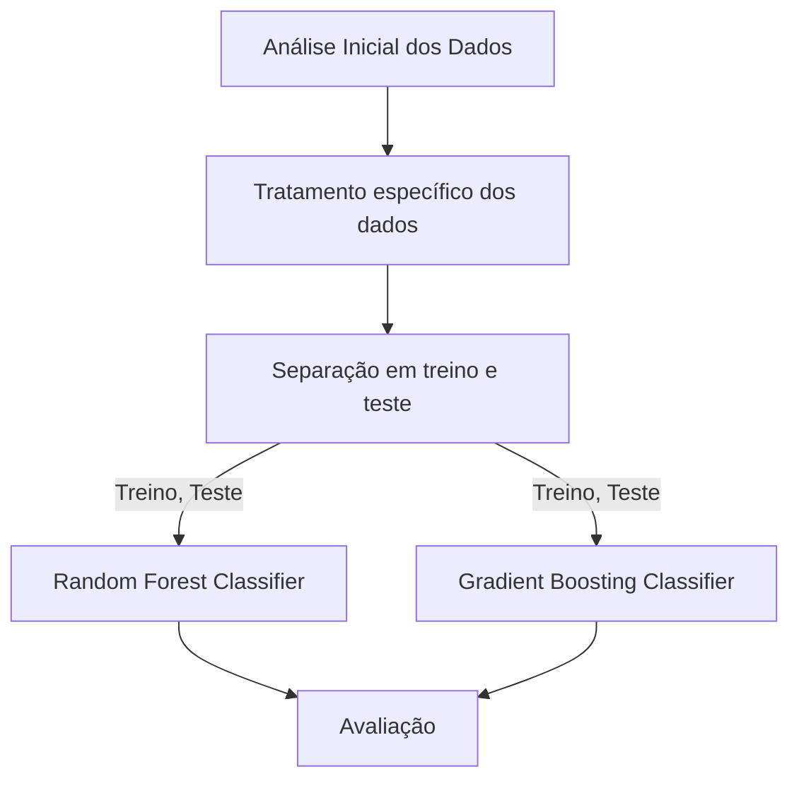

# UME - Teste Prático

Este repósitorio serve para armazenar os códigos referente ao teste da UME que consiste na análise e predição de perfil de clientes (Bom ou Mal Pagador). 

## Modelo Random Forest



A imagem acima refere-se aos resultados do modelo Random Forest, o qual apresentou um recall equilabrado entre bons e maus pagadores.

## Modelo GBOOST



A imagem acima refere-se aos resultados do modelo Gradient Boosting, o qual apresentou um recall maior para maus pagadores.

## Fluxo de construção do modelo



---

## Arquivos:

- sample15k_synth_2022.csv (banco de dados)
- acme_description.csv (descrição das variáveis presentes no banco de dados) 
- acme_analysis_and_forecast.ipynb (notebook escrito em python3)
- requirements.ipynb (comando pip para instalar as bibliotecas)

## Pré-requisitos:

- Jupyter.
- As bibliotecas necessárias estão no arquivo requirements.txt pip install -r requirements.txt (comando pip para instalar as bibliotecas).

## Rodar:

``` 
jupyter notebook acme_analysis_and_forecast.ipynb 
```

